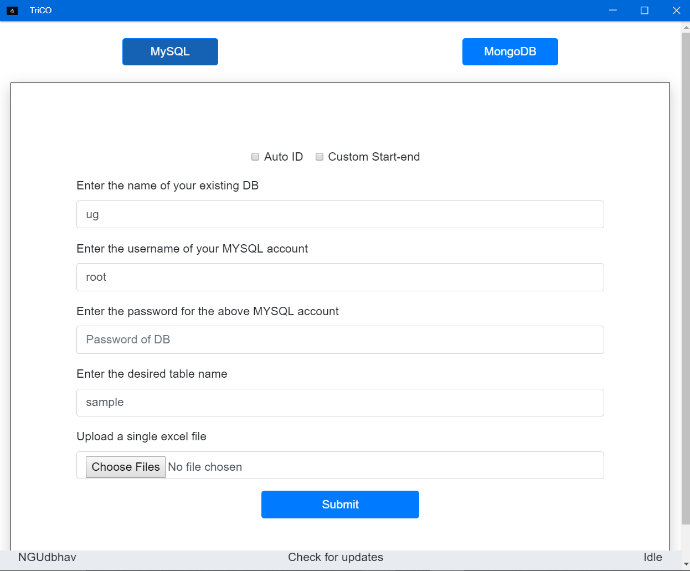
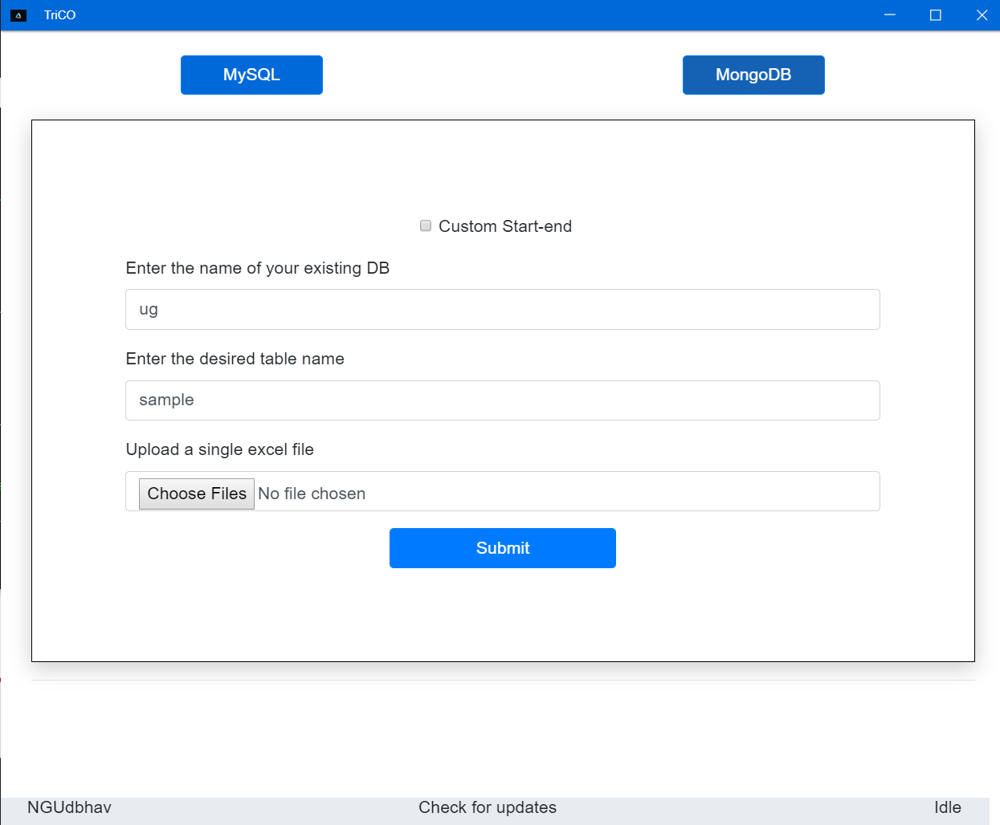

# TriCo-electron-app

[](https://github.com/ngudbhav/TriCo-electron-app/releases)
[](https://github.com/ngudbhav/TriCo-electron-app/blob/master/package.json)
[](https://github.com/ngudbhav/TriCo-electron-app/releases)
[](https://github.com/ngudbhav/TriCo-electron-app/releases)
[](https://github.com/ngudbhav/TriCo-electron-app/releases)

This App Converts your correctly formatted Excel Spreadsheet to a specified table/collection in specified Database in MYSQL/MongoDB.

## Do checkout the upcoming features in CHANGELOG.md





# Excel Formats Supported
Supported Excel formats are XLS/XLSX

# Usage
The Database must already be there. A table name should be provided.

# Spreadsheet Format
Please have a look at the sample Excel sheets provided to have a clear view of the File. <a href="https://go.microsoft.com/fwlink/?LinkID=521962">Microsoft Sample Sheet</a>

# Starting The App
```sh
sudo npm install -g electron
git clone https://github.com/ngudbhav/excel-to-mysql-electron-app.git
cd excel-to-mysql-electron-app
npm install
npm start
```

# Installing The App
```sh
Setup.exe => Full Windows install
Portable.exe => Unzip and run the exe.
Setup.deb => Installable on Debian distributions (Ubuntu, Kali, etc.)
Setup.rpm => Installable on Red Hat distributions (Fedora, etc.) 
```

# Software Featured on Softpedia and Electronjs
<a href="https://www.softpedia.com/get/Internet/Servers/Database-Utils/TriCO.shtml">Softpedia Link</a>
<a href="https://electronjs.org/apps/trico">Electronjs Link</a>

# Do rate and give Feedback!

P.S. This app saves the previosuly entered information in the systems %APPDATA% directory so that the whole information is not typed again.
NOTHING is collected by me. Also, this app establishes connection to the internet to check for the updates.
