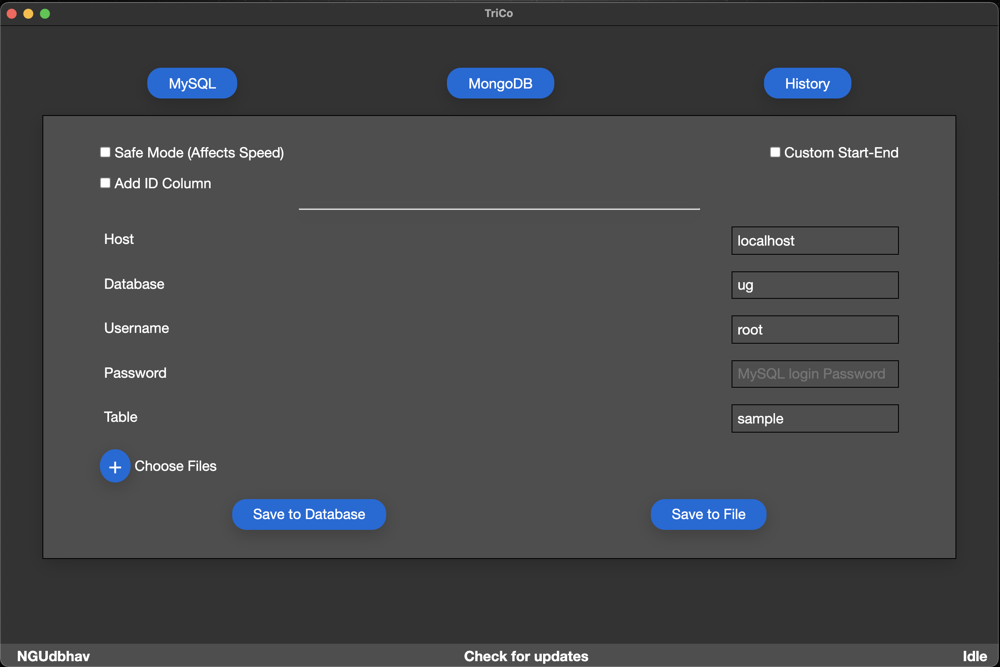
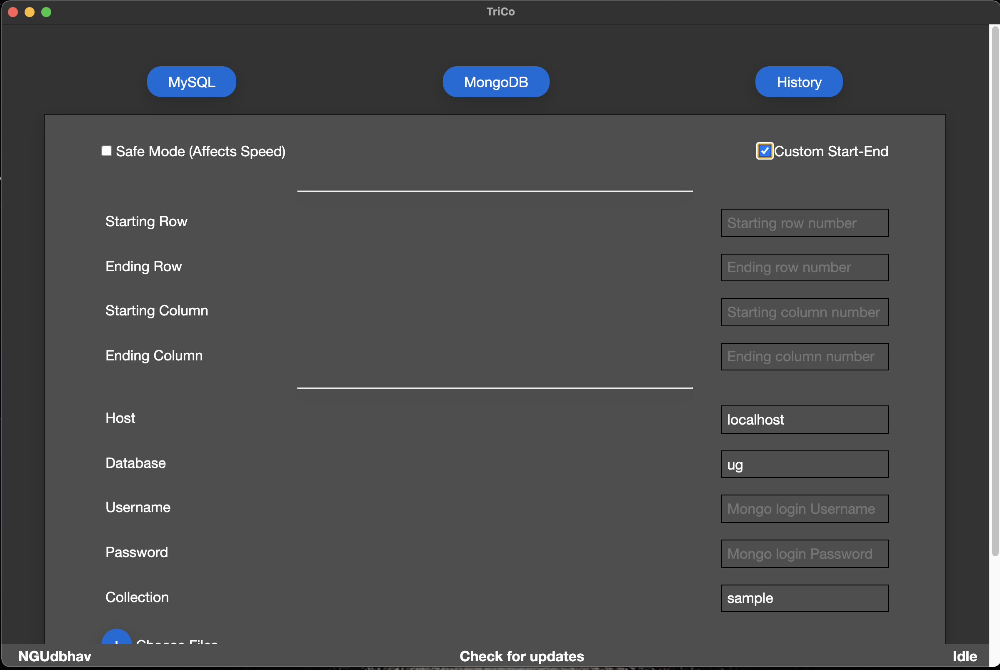

# TriCo-electron-app

[](https://github.com/ngudbhav/TriCo-electron-app/releases)
[](https://github.com/ngudbhav/TriCo-electron-app/blob/master/package.json)
[](https://github.com/ngudbhav/TriCo-electron-app/releases)
[](https://github.com/ngudbhav/TriCo-electron-app/releases)
[](https://github.com/ngudbhav/TriCo-electron-app/releases)

This App Converts your correctly formatted Excel Spreadsheet to a specified table/collection in specified Database in MYSQL/MongoDB.

## Do checkout the upcoming features in CHANGELOG.md

## Features
1. Dump your excel/csv sheet into your preferred your DB.
2. Batch Files support
3. Do not want to dump the whole file? You can also try selecting a range of columns and rows.
4. Automaticaly add `id` as primary key (MySQL)
5. Scared of loosing your DB? Safe mode backs up the db before processing.
6. Dump the excel sheet into a `.sql` instead (MySQL)
7. History Maintainance.





## Excel Formats Supported
Supported Excel formats are XLS/XLSX/CSV

## Spreadsheet Format
Please have a look at the sample Excel sheets provided to have a clear view of the File. <a href="https://go.microsoft.com/fwlink/?LinkID=521962">Microsoft Sample Sheet</a>

## Starting The App
```sh
sudo npm install -g electron
git clone https://github.com/ngudbhav/TriCo-electron-app.git
cd TriCo-electron-app
npm install
npm start
```

## Installing The App

OS | Installer? | File
--- | --- | ---
Windows 32-BIT | Portable |  <a href="https://github.com/ngudbhav/TriCo-electron-app/releases/download/v3.0.0/Portable-x86.exe">Portable-x86.exe</a>
Windows 32-BIT | Setup |  <a href="https://github.com/ngudbhav/TriCo-electron-app/releases/download/v3.0.0/Setup-x86.exe">Setup-x86.exe</a>
Windows 64-BIT | Portable |  <a href="https://github.com/ngudbhav/TriCo-electron-app/releases/download/v3.0.0/Portable-x64.exe">Portable-x86.exe</a>
Windows 64-BIT | Setup |  <a href="https://github.com/ngudbhav/TriCo-electron-app/releases/download/v3.0.0/Setup-x64.exe">Setup-x86.exe</a>
Linux | ZIP |  <a href="https://github.com/ngudbhav/TriCo-electron-app/releases/download/v3.0.0/TriCo-3.0.0-linux.zip">TriCo-3.0.0-linux.zip</a>
Linux Debian (Ubuntu, etc.) | Setup |  <a href="https://github.com/ngudbhav/TriCo-electron-app/releases/download/v3.0.0/TriCo_3.0.0_amd64.deb">TriCo_3.0.0_amd64.deb</a>
Linux Redhat (Fedora, etc.) | Setup |  <a href="https://github.com/ngudbhav/TriCo-electron-app/releases/download/v3.0.0/TriCo-3.0.0.x86_64.rpm">TriCo-3.0.0.x86_64.rpm</a>
Mac OS X | ZIP |  <a href="https://github.com/ngudbhav/TriCo-electron-app/releases/download/v3.0.0/TriCo-3.0.0-mac.zip">TriCo-3.0.0-mac.zip</a>
Mac OS X | Setup |  <a href="https://github.com/ngudbhav/TriCo-electron-app/releases/download/v3.0.0/TriCo-3.0.0.dmg">TriCo-3.0.0.dmg</a>
<br/>

## Software Featured on Softpedia and Electronjs
<a href="https://www.softpedia.com/get/Internet/Servers/Database-Utils/TriCO.shtml"></a><br><br>
<a href="https://electronjs.org/apps/trico">Electronjs Link</a>

## Do rate and give Feedback!

P.S. This app saves the previosuly entered information in the systems %APPDATA% directory so that the whole information is not typed again.
NOTHING is collected by me. Also, this app establishes connection to the internet to check for the updates.
